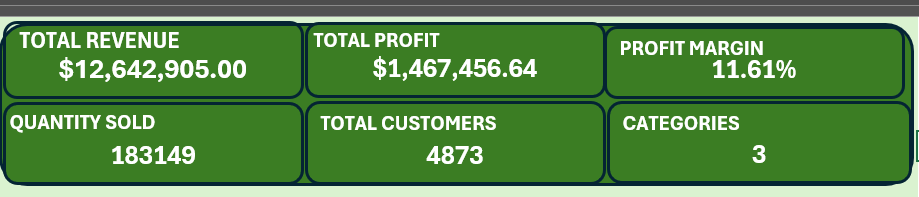
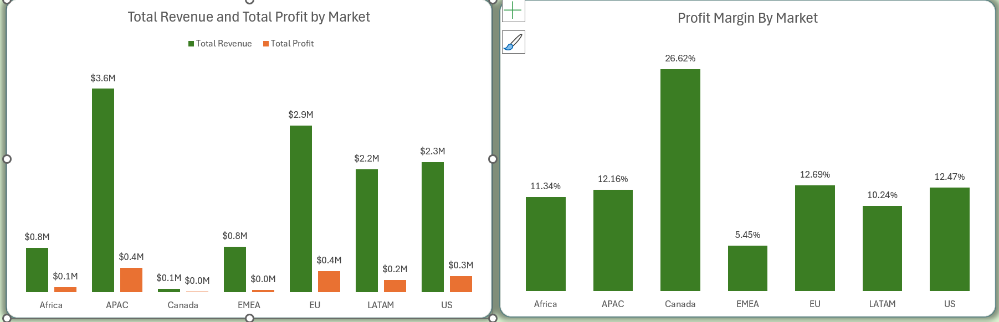
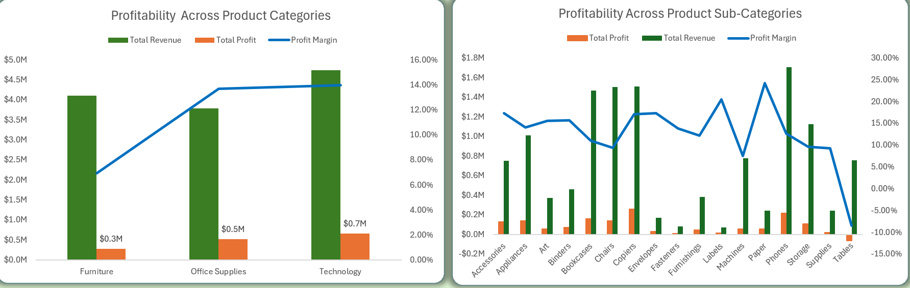
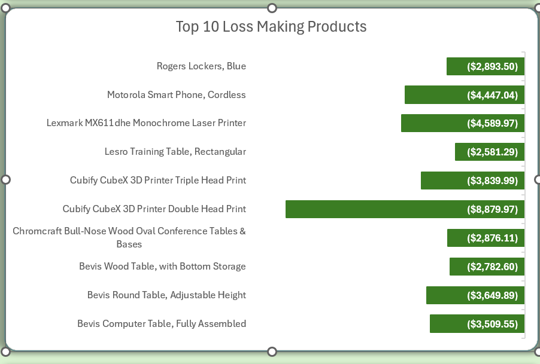
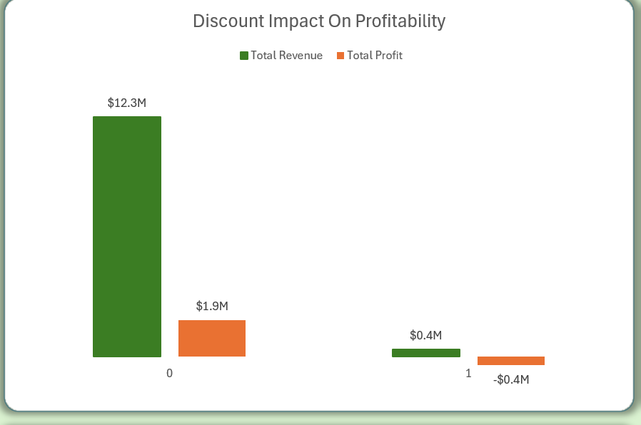
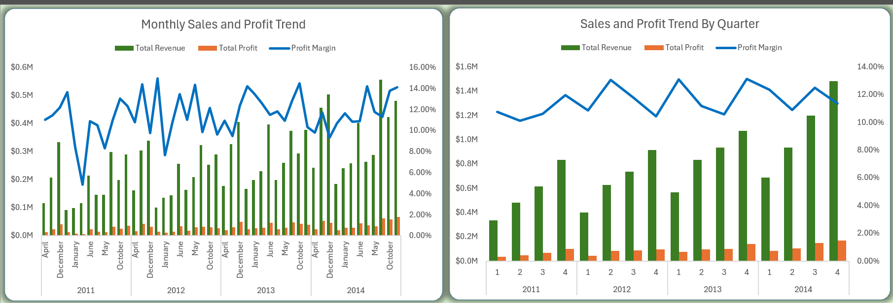
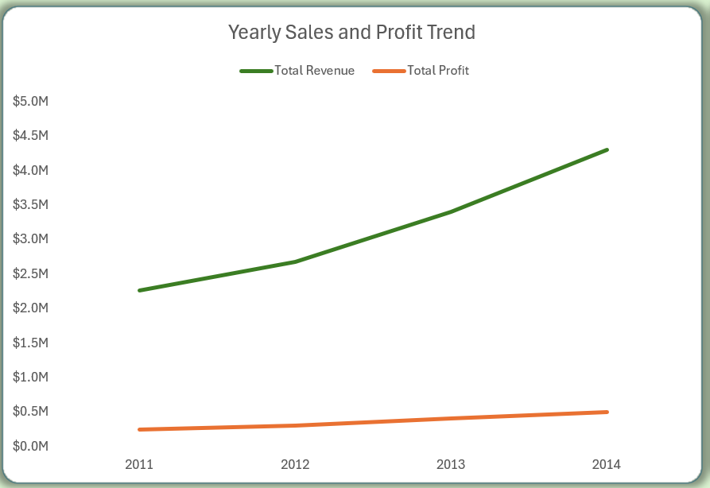
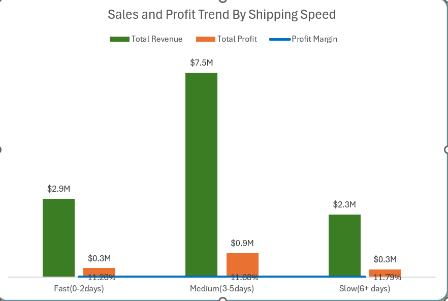

# Global-Superstore

## Project Overview

This project analyzes sales performance, profitability, and operational efficiency of a Global Superstore using Microsoft Excel.
The goal is to uncover business insights that can guide decision-making around markets, products, pricing, discounts, and shipping operations.

## Business Objectives

The analysis was guided by the following objectives:

- Understand overall sales and profit performance across markets

- Identify profitable and loss-making regions, categories, and products

- Evaluate the impact of discounts on profitability

- Analyze shipping efficiency and its relationship with profit

- Provide actionable insights through dashboards and visual storytelling

 ## Dataset Description

**Source*: Kaggle – Global Superstore Dataset
*Scope*: Global sales transactions across multiple regions and years

**Key Columns Used**

**Time**: Order Date, Ship Date, Year, Week Number

**Geography**: Market, Region, Country, State, City

**Product**: Category, Sub-Category, Product Name

**Customer**: Segment, Customer ID

**Sales Metrics**: Sales, Profit, Quantity, Discount

**Operations**: Ship Mode, Shipping Cost, Order Priority

Note: The Discount column is binary (0 = no discount, 1 = discount applied).

## Tools & Techniques

*Microsoft Excel*

- Power Query (data cleaning & transformation)

- Power Pivot (data modeling)

- DAX measures (KPIs)

- Pivot Tables & Pivot Charts

- Excel Dashboards
  

## Key Metrics (KPIs)

The following KPIs were created using DAX:

Total Revenue: 

Total Profit

Profit Margin

Average Profit

Categories

## Key Business Questions Answered

## Market Performance

### Which markets generate the highest and lowest revenue and profit?

1. APAC leads in both revenue and profit, making it the strongest performing market overall.
  
2. EU and the US also contribute significantly to total revenue, with solid profit generation.
  
4. Africa, EMEA, and Canada record relatively low revenue and profit, indicating smaller market size or lower sales activity.
  
5. While higher revenue generally aligns with higher profit, profit levels vary across markets, highlighting differences in cost structure and operational efficiency.
  
6. What is the total revenue, total profit, and profit margin of the Global Superstore?

## Product Category & Sub-Category Performance

 ### Which product categories and sub-categories are the most and least profitable?
 

#### Category-level insights

- Technology is the most profitable category, generating the highest profit ($663.8K) and the strongest profit margin (≈14.0%).

- Office Supplies also performs well, with a solid profit margin (13.69%) despite slightly lower revenue than Technology.

- Furniture is the least profitable category, recording the lowest profit margin (6.94%), indicating weaker cost efficiency.

#### Sub-category-level insights

- Copiers, Paper, Labels, Accessories, and Envelopes are the most profitable sub-categories, with profit margins ranging from 17% to over 24%.

- Tables is the only loss-making sub-category, generating a negative profit (−$64.1K) and a −8.47% profit margin, despite relatively high revenue.

- Machines, Chairs, Storage, and Supplies show comparatively low margins, suggesting potential pricing or cost challenges.

📌 Key takeaway:
High revenue does not always translate into high profitability. While Technology drives strong profits, Furniture—particularly Tables—requires strategic review to address margin erosion.

## Loss-Making Products

### Which products consistently generate losses despite generating sales?

- The analysis identified the top 10 loss-making products, each contributing negative profit despite recorded revenue.

- Technology and Furniture products dominate the loss list, notably high-cost items such as 3D printers, conference tables, and laser printers.

- The Cubify CubeX 3D Printer (Double Head) is the largest loss contributor (−$8.88K), followed by Lexmark MX611dhe Monochrome Laser Printer and Motorola Smart Phone, Cordless.

- Several tables and storage products (Bevis and Rogers brands) also show persistent losses, suggesting pricing, discounting, or cost-structure issues.
  

## Discount Impact Analysis

### How do discounts affect revenue and profitability?

- Non-discounted orders drive the vast majority of revenue and profit, generating $12.27M in revenue and $1.88M in profit.

- Discounted orders contribute minimal revenue ($0.37M) but result in a net loss (−$0.41M), indicating that discounts are eroding profitability.

- Despite generating sales, discounted transactions consistently underperform, suggesting that current discount strategies are not cost-effective.

## Time-Series Performance (Yearly)

### How do sales and profit trend over time?

- Sales and profit show a clear upward trend year over year, with total revenue increasing from $2.26M in 2011 to $4.30M in 2014.

- Profit growth closely follows revenue growth, rising from $248.9K in 2011 to $504.2K in 2014, indicating improving overall performance.

- While revenue grows consistently, profit margins fluctuate across years and quarters, suggesting periods of operational efficiency gains as well as cost and pricing pressures.

- Later years (2013–2014) outperform earlier years, driven by stronger quarterly and end-of-year performance, particularly in Q3 and Q4.

## Shipping Efficiency

### How long does it take to ship orders, and does shipping delay affect profit?

- Orders shipped faster (Same Day, First Class) yield consistent profit margins.

- Slower shipping (Standard Class) still generates high revenue due to volume, but extended delivery times may slightly reduce profit efficiency.

- Optimizing shipping speed can improve both customer satisfaction and profitability.

- 🔗 Interact with the dashboard: [View here](https://docs.google.com/spreadsheets/d/18e-q9pZsMRnqcDO5XdxPAf_yn9O9J45e/edit?usp=sharing&ouid=116338540508423812595&rtpof=true&sd=true)

## Recommendtions

- Redesign the discounting strategy to eliminate margin erosion by restricting discounts to high-margin products, targeted customer segments, and clearly defined strategic periods.

- Rationalize the product portfolio by repricing, renegotiating supplier terms, bundling, or discontinuing consistently loss-making products.

- Reposition the Furniture category for profitability by correcting pricing, logistics costs, and discount policies, and exiting structurally unprofitable sub-categories.

- Prioritize investment in high-margin categories such as Technology and Office Supplies to accelerate scalable, profitable growth.

- Optimize regional performance rather than expanding footprint by focusing on margin improvement and cost efficiency in underperforming markets while protecting core regions.

- Improve logistics efficiency and delivery speed by renegotiating carrier contracts, optimizing shipping modes, and enforcing fulfillment Servie Level Agreements to reduce cost drag.

- Align inventory and marketing with seasonal demand peaks to maximize revenue and margin capture during high-impact periods.

- Shift strategic focus from revenue growth to margin expansion by embedding profitability KPIs into pricing, promotions, product, and operational decisions.
